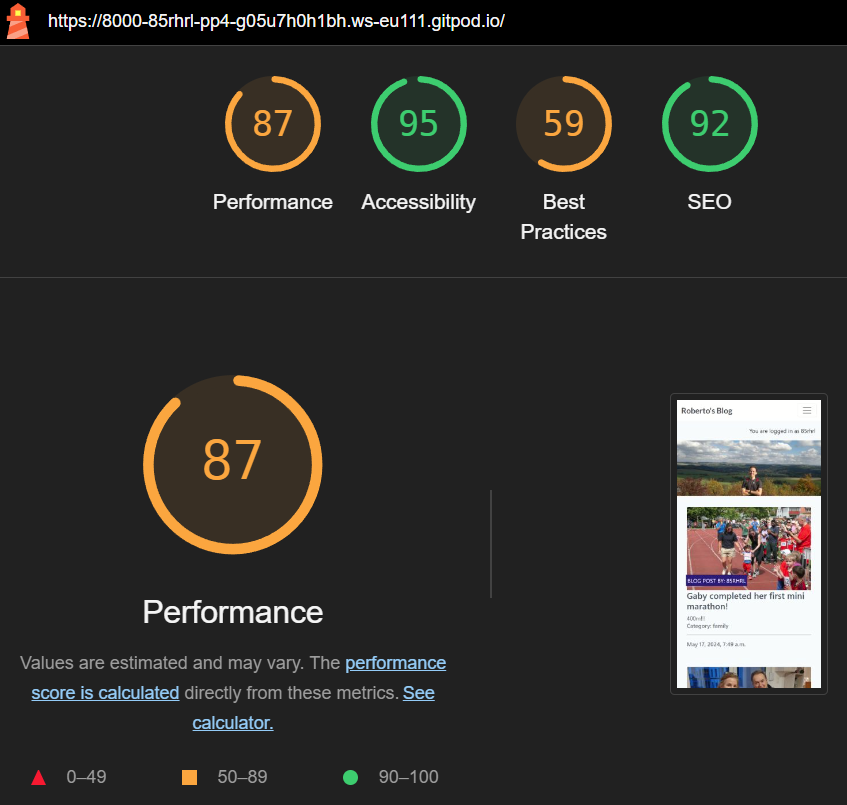
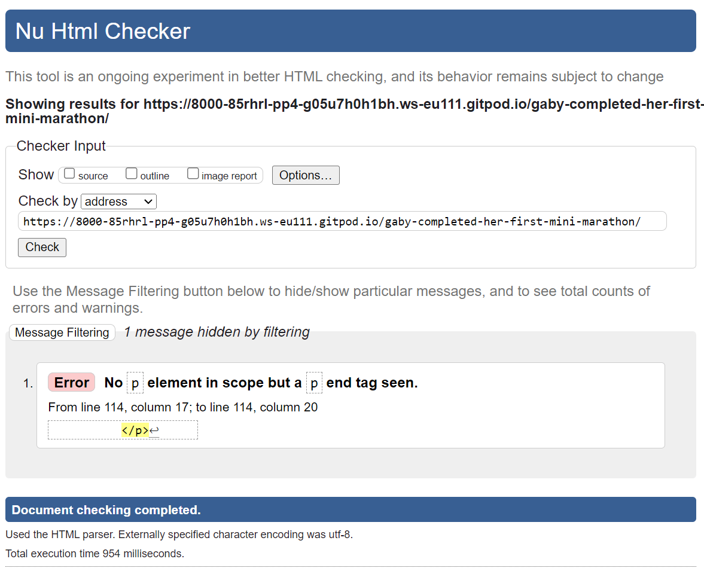
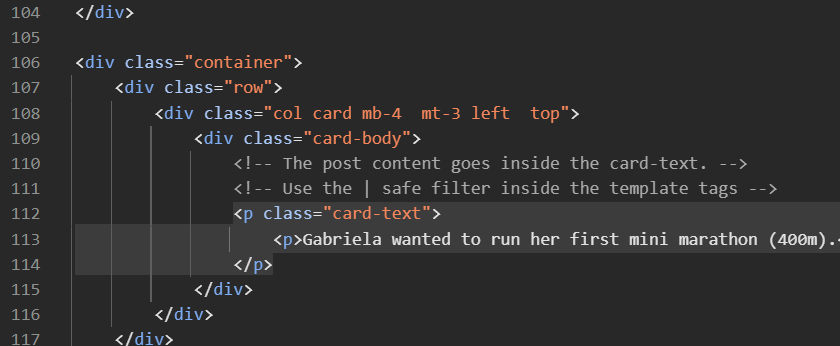

# Roberto's Blog
Roberto's Blog is a website where you can find out what Roberto is doing at the time.

Visit the deployed Roberto's Blog here: [https://pp4-85rhrl-0aee24205305.herokuapp.com/](https://pp4-85rhrl-0aee24205305.herokuapp.com/)

## Features

### Existing Features

- __Navigation Bar__
    - Across the whole website there is a navigation bar on top which includes links to the Logo and Home which will take the user back to the homepage, there are also links for About Me & Contact and Logout or Register & Login depending wether the user is loged in or not.
    - This navigation bar will adapt to the screen size or even hide into a burger icon to improve the User Experience.

    

    - The Home, About Me & Contact, Login or Register & Login links will turn bold font whenever clicked to let the user know in which page they currently are.

    

- __Home page__
    - In the home page the user will find a hero image with a list of blog posts below.

    

- __Blog posts list & Page navigation links__
    - The blog posts are displayed either in a horizontal or vertical manner depending of the used device.
    - Below the blog posts the PREV and NEXT links are displayed to see more blog posts.

    

- __Footer__
    - At the bottom of the page a link to the source code is displayed and can be seen in the image above.

- __Blog post__
    - A blog post header contains the title, author, category, creation date and image.
    - Below the header the content of the blog post is displayed.
    - After the blog's content an chat icon is displayed with the number of approved comments.
    - Finally the list of comments are displayed.
    - For logged in users, a text box is displayed on the right hand side to post a comment.

    

- __About me__
    - Information about Roberto can be found in About me & Contact page.
    - The last update is displayed on the bottom right hand corner.

    

- __Contact__
    - A form to contact Roberto is displayed below About me.

    

- __Account registration__
    - To be able to comment on posts, the blog visitor must create an account.

    

### Features Left to Implement

- __Send an email to registered users whenever there is a new blog post.__

## Technologies used

### Languages
- __Python__
- __HTML5__
- __JavaScript__
- __CSS3__

### Tools & Frameworks
- __GitHub__ - Used for version control, bug reporting and hosting the repository.
- __Heroku__ - Used for deploying the website.
- __Cloudinary__ - Used for storing the images.
- __Django__ - Used as the python framework.
- __ElephantSQL__ - Used as the database for this project.
- __Bootstrap__ - Used as the CSS framework.

## Testing

### Validator testing

- __HTML__
    - The HTML code was tested using the W3C Markup Validator and no errors were found.
            

- __CSS__
    - The CSS code was tested using the CSS Validation Service and no errors were found.
            

- __JavaScript__
    - The JavaScript for comments.js code was tested using the JSHint static code analysis tool and no errors were found.
            

- __Python__
    - The code was passed through the Code Institute's PEP8 Python Linter with no errors found.

### Lighthouse

Lighthouse is an open-source automated tool to audit a page based on its Performance, Accessibility, Best Practices and Search Engine Optimization (SEO). This audit was performed and the results are shown below.
    

### Unfixed Bugs

When running the W3C Markup Validator on a blog post, the following error is shown:
    
But after checking the code, the starting p element is present in the code as shown here:
    

## Deployment
GitHub, Cloudinary, ElephantSQL and Heroku were used to deploy Roberto's Blog:

1. Fork or clone the [github.com/85rhrl/PP4](https://github.com/85rhrl/PP4) repository.
2. Create an account with Cloudinary [cloudinary.com/users/register_free](https://cloudinary.com/users/register_free) and take note of the _API environment variable_ found in _Dashboard_
3. Create an account with ElephantSQL and create an instance for a database: [customer.elephantsql.com/instance/create](https://customer.elephantsql.com/instance/create) and take note of the URL in _Details_.

4. Create a new [Heroku](https://www.heroku.com/) app with a unique name.
5. From the _Settings_ tab in Heroku click on Reveal Config Vars:
    - Create a _Config Var_ called `CLOUDINARY_URL` and set it to the URL from step 2.
    - Create a _Config Var_ called `DATABASE_URL` and set it to the URL from step 3.
    - Create a _Config Var_ called `SECRET_KEY` and set it to a generated password of your choice.
6. Under Buildpacks add the `heroku/python` buildpack.
7. Connect the Heroku app to the repository from Step 1.
8. On your IDE of preference:
    - Add a env.py on the root with the following:
        - os.environ.setdefault("DATABASE_URL", "URL from step 3")
        - os.environ.setdefault("SECRET_KEY", "Generated password from step 5")
        - os.environ.setdefault("CLOUDINARY_URL", "URL from step 2")

    - Add env.py to .gitignore to avoid sharing this file
    - Create a Procfile on the root with the following content:
        - web: gunicorn yourprojectname.wsgi
    - On the setings.py file of the project's folder:
        - import Path from pathlib, import os, import sys and import dj_database_url
        - SECRET_KEY = os.environ.get("SECRET_KEY")
        - if os.path.isfile("env.py"): import env
        - Set DEBUG = False
        - Set ALLOWED_HOSTS = ['gitpod.io link for local deployment'
                ,'.herokuapp.com for cloud deployment']
        - DATABASES = {'default': dj_database_url.parse(os.environ.get("DATABASE_URL"))}
    - Make migrations and migrate
    - Commit and push to GitHub
9. On Heroku under Deploy tab click on _Deploy_

## Credits
The code is based on the "I Think Therefore I Blog" walkthrough tutorial made by Code Institute.

The font was downloaded from [Google Fonts](https://fonts.google.com/).

### Media

The images were downloaded from [Pexels](https://www.pexels.com/).

### Acknowledgements

I would like to express my gratitude to the following people:

- Jubril Akolade for mentoring me, giving me guidance and encouragement.
- Kay Welfare for their continuous help and encouragement.
- My fellow classmates for their support and feedback.
- Last but not least to my lovely wife for taking care of our newborn baby and our daughter.