# Roberto's Blog
Roberto's Blog is a website where you can find out what Roberto is doing at the time.

Visit the deployed Roberto's Blog here: [https://pp4-85rhrl-0aee24205305.herokuapp.com/](https://pp4-85rhrl-0aee24205305.herokuapp.com/)

## Features

### Existing Features

- __Navigation Bar__
    - Across the whole website there is a navigation bar on top which includes links to the Logo and Home which will take the user back to the homepage, there are also links for About Me & Contact and Logout or Register & Login depending wether the user is loged in or not.
    - This navigation bar will adapt to the screen size or even hide into a burger icon to improve the User Experience.

    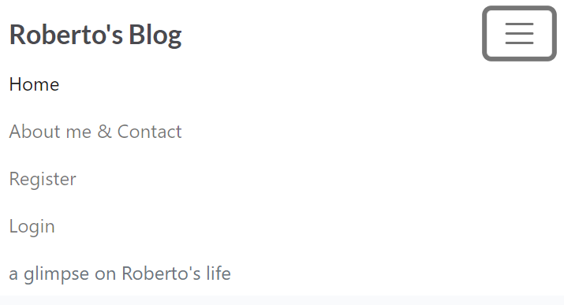

    - The Home, About Me & Contact, Login or Register & Login links will turn bold font whenever clicked to let the user know in which page they currently are.

    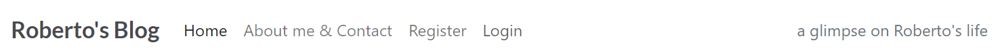

- __Home page__
    - In the home page the user will find a hero image with a list of blog posts below.

    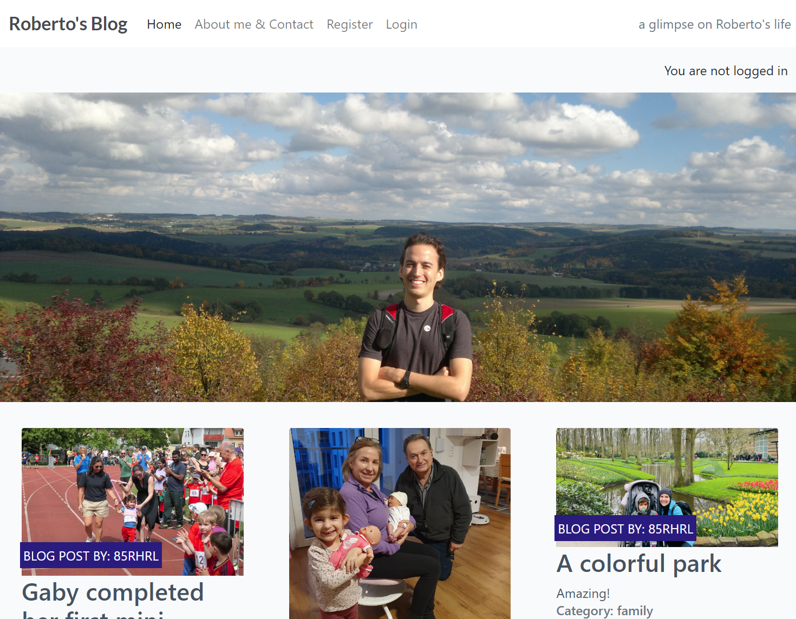

- __Blog posts list & Page navigation links__
    - The blog posts are displayed either in a horizontal or vertical manner depending of the used device.
    - Below the blog posts the PREV and NEXT links are displayed to see more blog posts.

    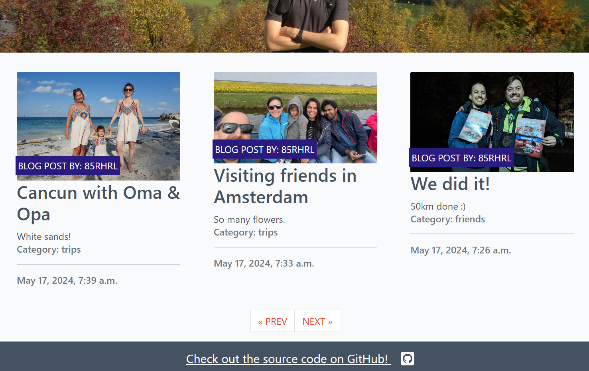

- __Footer__
    - At the bottom of the page a link to the source code is displayed and can be seen in the image above.

- __Blog post__
    - A blog post header contains the title, author, category, creation date and image.
    - Below the header the content of the blog post is displayed.
    - After the blog's content an chat icon is displayed with the number of approved comments.
    - Finally the list of comments are displayed.
    - For logged in users, a text box is displayed on the right hand side to post a comment.

    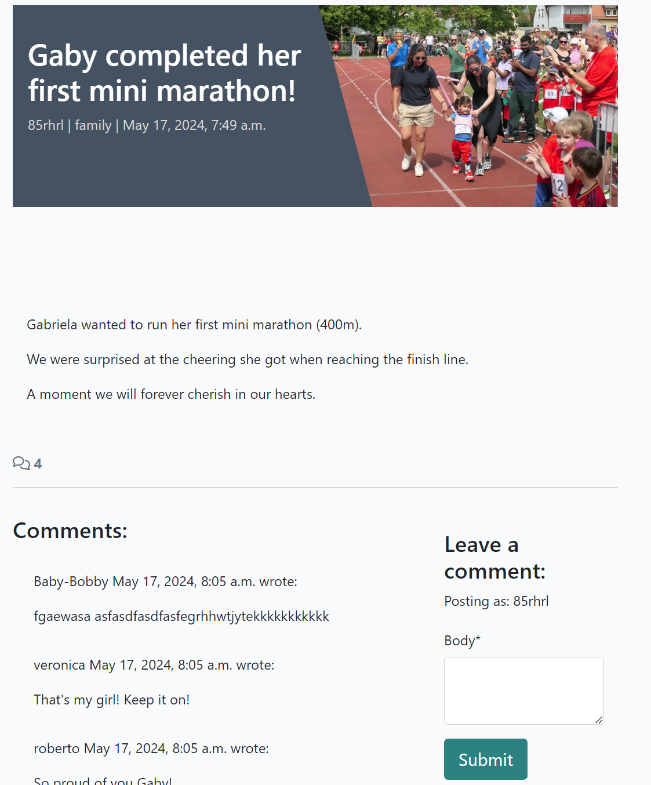

- __About me__
    - Information about Roberto can be found in About me & Contact page.
    - The last update is displayed on the bottom right hand corner.

    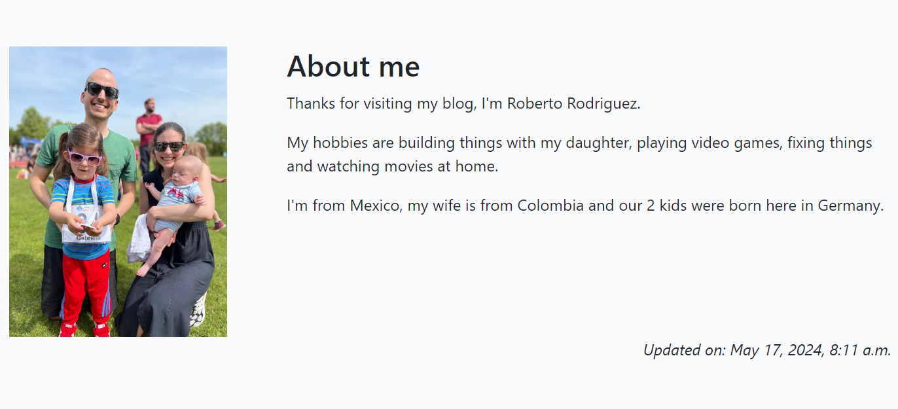

- __Contact__
    - A form to contact Roberto is displayed below About me.

    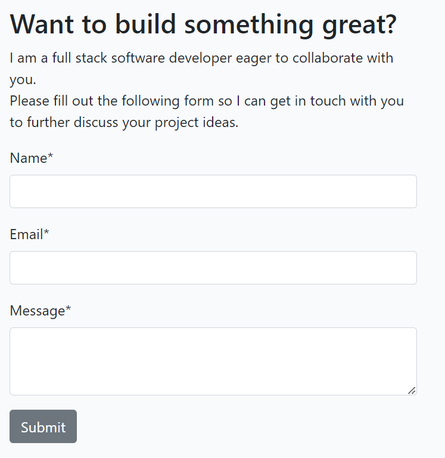

- __Account registration__
    - To be able to comment on posts, the blog visitor must create an account.

    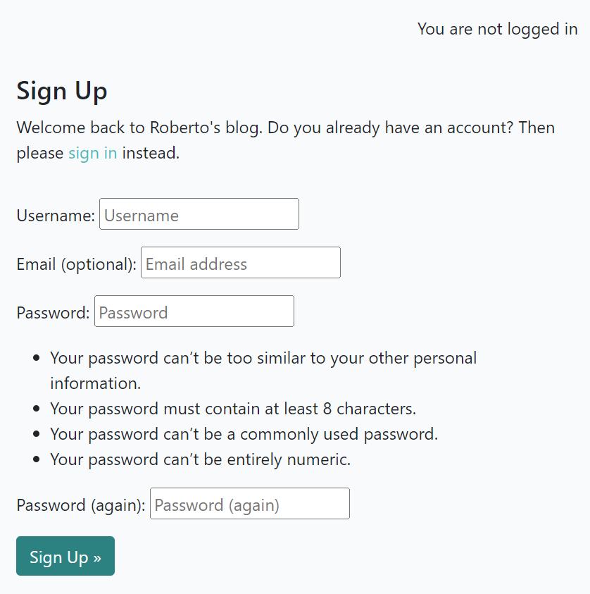

### Features Left to Implement

- __Send an email to registered users whenever there is a new blog post.__

## Technologies used

### Languages
- __Python__
- __HTML5__
- __JavaScript__
- __CSS3__

### Tools & Frameworks
- __GitHub__ - Used for version control, bug reporting and hosting the repository.
- __Heroku__ - Used for deploying the website.
- __Cloudinary__ - Used for storing the images.
- __Django__ - Used as the python framework.
- __ElephantSQL__ - Used as the database for this project.
- __Bootstrap__ - Used as the CSS framework.

## Testing

### Validator testing

- __HTML__
    - The HTML code was tested using the W3C Markup Validator and no errors were found.
            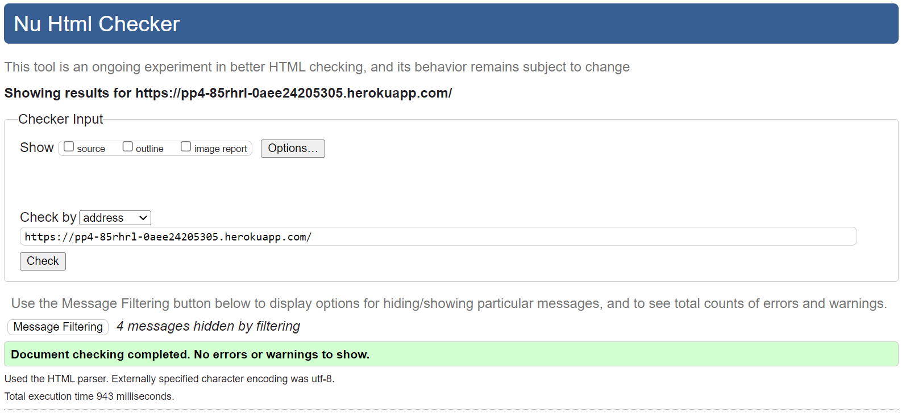

- __CSS__
    - The CSS code was tested using the CSS Validation Service and no errors were found.
            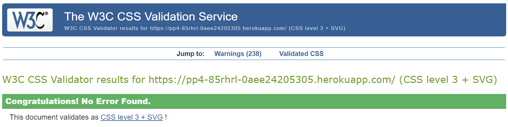

- __JavaScript__
    - The JavaScript for comments.js code was tested using the JSHint static code analysis tool and no errors were found.
            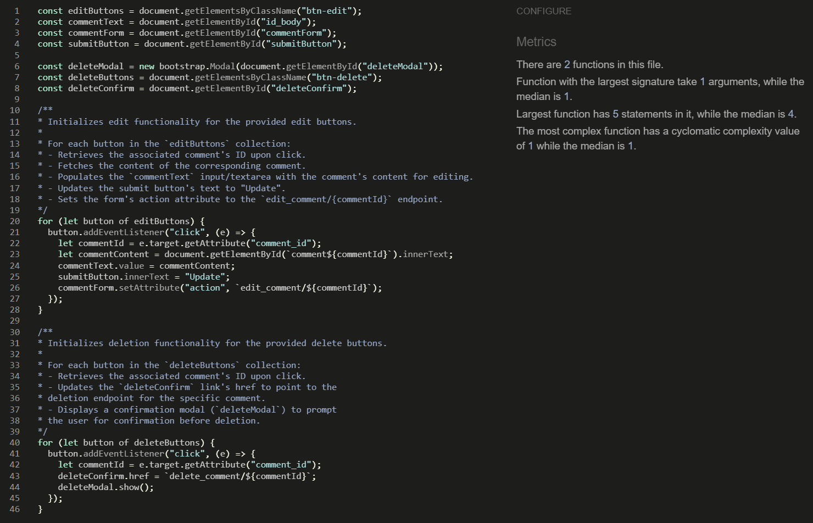

- __Python__
    - The code was passed through the Code Institute's PEP8 Python Linter with no errors found.